# T1A2 Portfolio Website - By Christopher Back #

**Portfolio website located here: [Portfolio](https://dazzling-joliot-bbc838.netlify.app/)**

**Github repo located here: [Github](https://github.com/storm0105/T1A2)**

## Purpose ##

The portfolio website I have created serves as a demonstration of my skills and personality to developers and/or IT professionals, with the goal of being able to act as a resume to prospective employers. The portfolio website will be regularly updated in the "Projects" page in order to display the skills I have learnt whilst studying at Coder Academy.

## Functionality and features ##

The site has 4 main pages and multiple features within, such as navbars that help ease navigation between the pages. All the pages have been linked together and all the links, such as the navbar, resume and socials have a hover pseudoclass applied to it so it enlarges and changes color to engage the audience and let them know that it is a link, not just plain text. 

In order to make my portfolio site more responsive, I have also added media queries at various points, mainly 992px and once the screen size hits that point, the layout of all my pages change in order to accomodate more space that is made available.

Please see below: 

### Home ###
The Home page was made with a very simple design that is responsive. The navigation bar is located right in the middle of the page, with it being in a column up to the screen size being 991 pixels width, and once it hits 992 pixels it changes into a row.
The navigation bar on the home page is different to the other three pages and will be explained in the next section. 
On top of that, my contact details is also listed underneath the navigation bar with my socials located in the footer.

### About me ###
The about me page has all the text and photos to be as a column whilst under 991 pixels width, however once it hits 992 pixels the layout changes in order to be more aesthetically pleasing than rather one column in the middle.
As for the navigation bar, as stated in the home page, it differs. The way it differs is that rather than just having it as a list in the middle of the screen, the navigation has now been pushed to the top of the page and under 600 pixels, it is displayed as a dropdown navigation with an icon located in the top left. Once the screen size reaches 601 pixels, the dropdown icon disappears and the navigation bar shows up as a banner at the top of the screen, with a transparent background in order to make it obvious and the words to be seen more clearer.
The about me page also has my resume linked on top of the footer as a text-link. Once it has been clicked, the PDF file of my resume will be opened.

### Projects ###
The projects page is rather simple, with only one project being located on it being my practise "Band page". As I complete more projects in the future, the projects page will be updated to include them. 
The navigation bar stays the same as the "About me" page, with it being a dropdown up to 600 pixels width and changing to a navigation bar at the top from 601 pixels onwards. This will stay the same for the blogs page.
The image in the projects page is an anchor tag so once it has been clicked on, I made it so it will open up a new tab that is linked to the project for easy accessibility. 

### Blogs ###
The blogs page contains 5 "cards" and were made to imitate the cards you see on sites such as carsales, gumtree and such where a small amount of information is displayed on the front of the card and it attracts you to click into it to read more information. 
The reason it was made as cards rather than a simple list with the blogs being linked on the same page was that it seemed more interesting to make it as cards and to test my CSS skills. At the moment, they are full of placeholder text, however once I accumulate more knowledge as a developer, hopefully they will one day be placed with proper knowledge. 
In order to be more user-friendly, the user must click the button in order to open the blog and once the button has been pressed, the blog will open in another tab.

## Sitemap ##
Each page on the sitemap is linked to each other, with the socials to contact me on in the footer of each page.

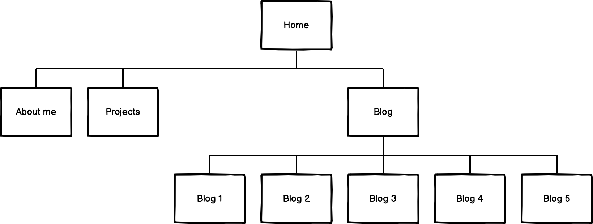

## Screenshots ##

### Mobile view ###
Home - 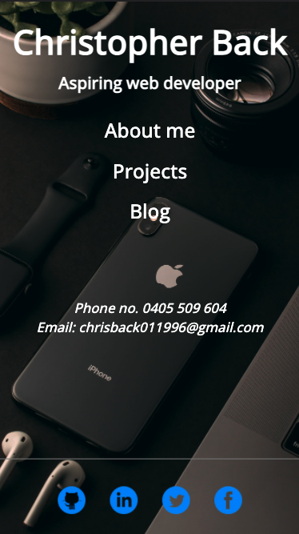
About me - 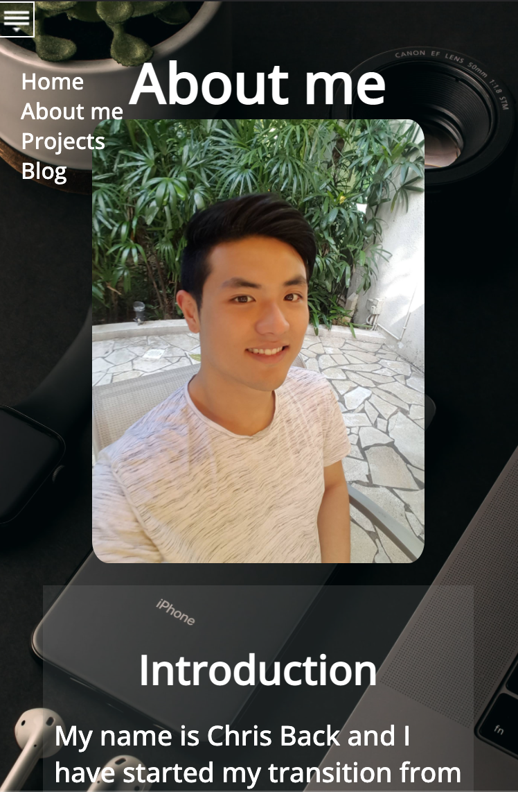
Projects - 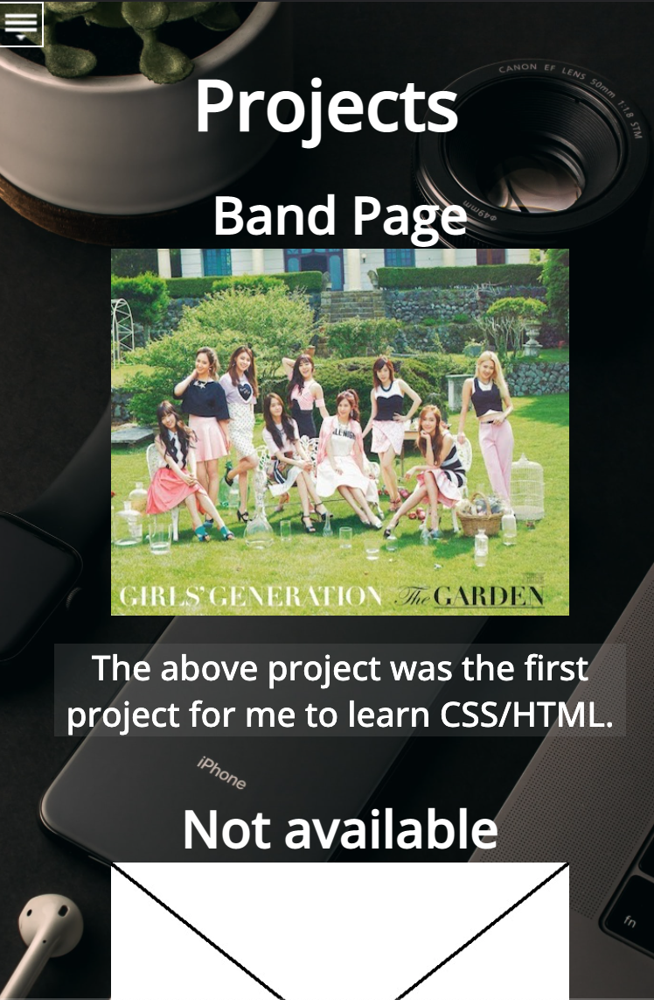
Blog - 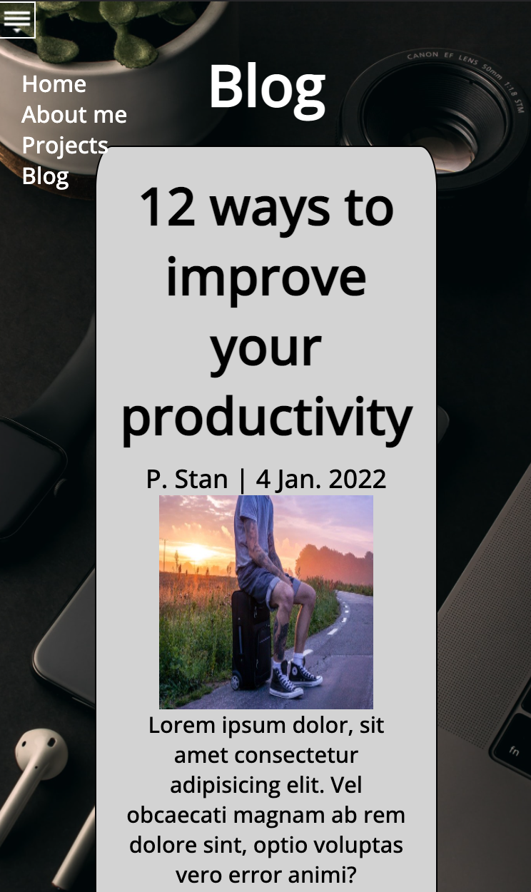

### Tablet view ###
Home - 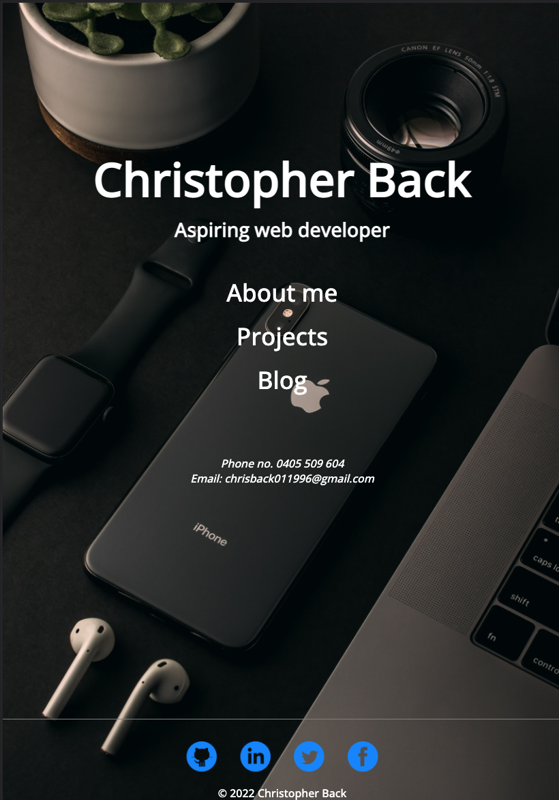
About me - 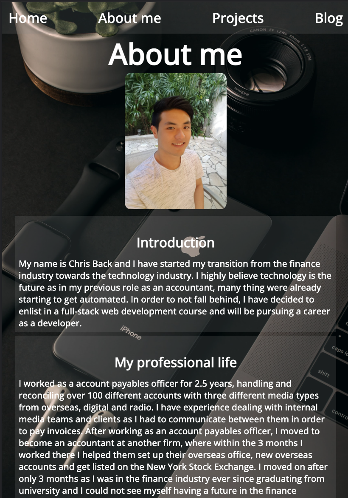
Projects - 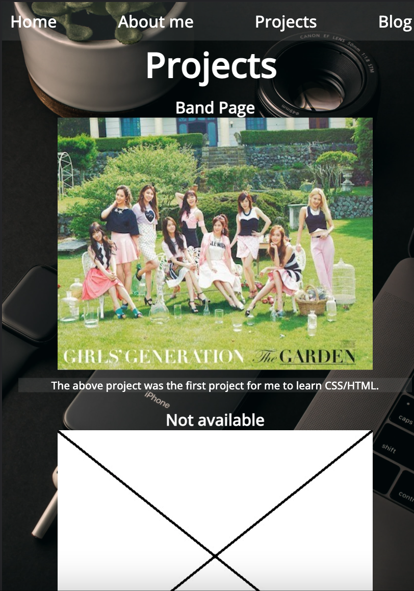
Blog - 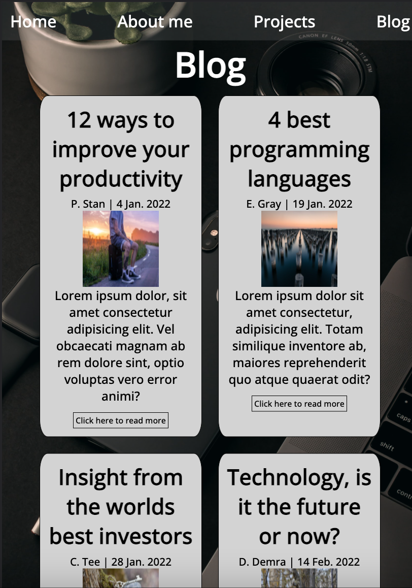

### PC view ###
Home - 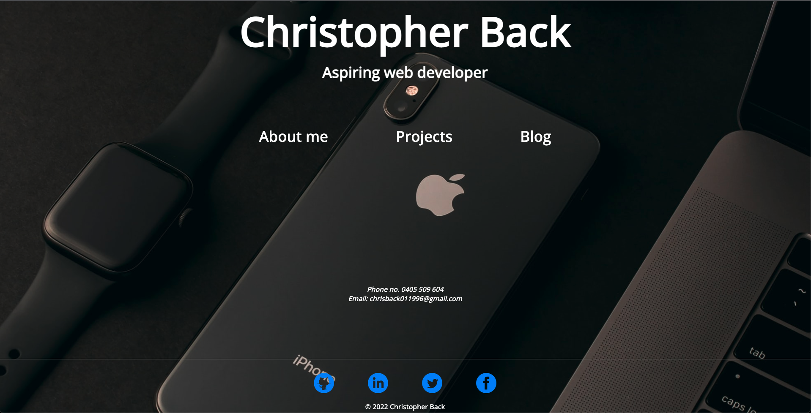
About me - 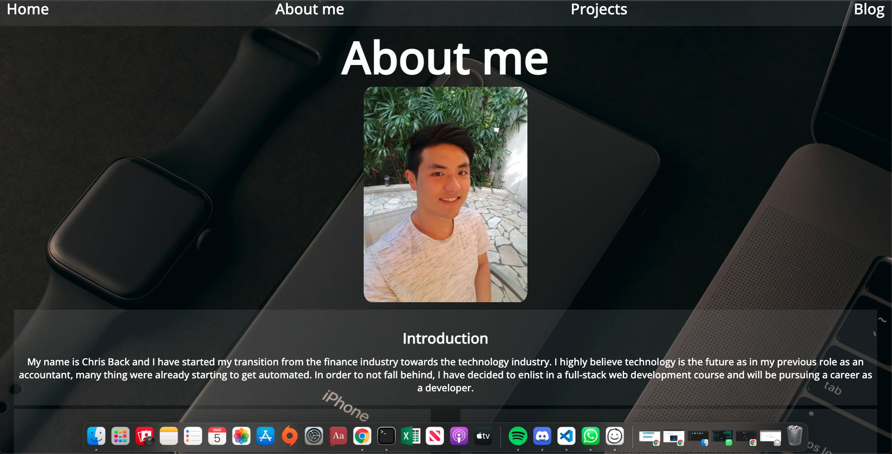
Projects - 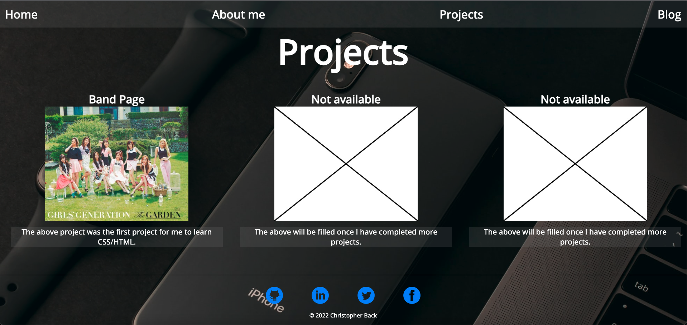
Blog - 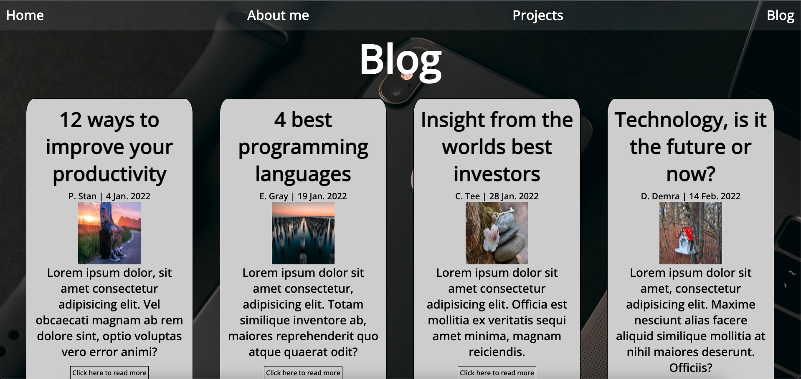

## Target Audience ##
The target audience for my portfolio website are developers and prospective employers. This project was finished with the idea to challenge myself and show my capabilities as a developer. 

By making it responsive to all screen sizes, it allows prospective employers to have a look at my portfolio on the go or at their desk.

## Tech Stack ##
I started by creating wireframes using Balsamiq Wireframes, which was then followed up by basic HTML and CSS. Only HTML and CSS was used in the creation of this portfolio and it was uploaded to Github every time I hit a milestone. Once the site was finished, it was deployed on Netlify.

